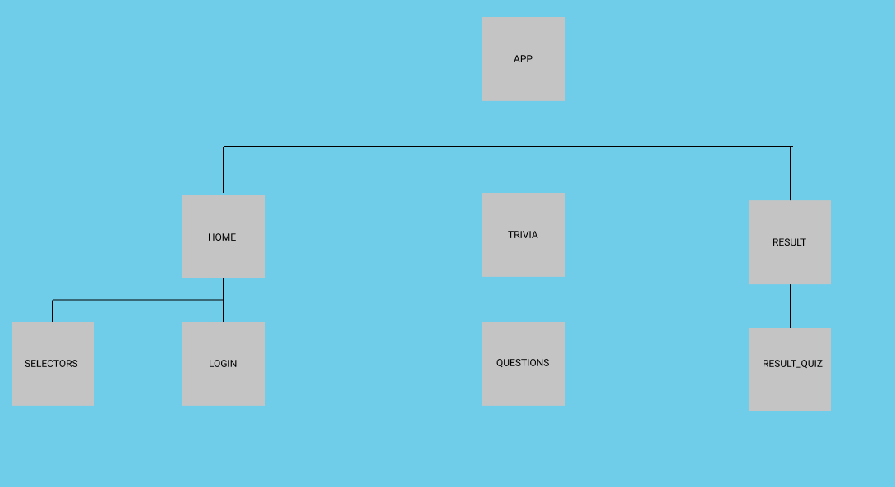

# trivia-game

## About the project

Trivia game consist of three parts: 
    - Start screen
    - Questions screen
    - Result screen
heroku link to the project: [here](https://trivia-quiz-game-noroff.herokuapp.com/#/)

### Start screen

The start screens jobb is to register a user if the users username isn't already in the database.
The it lets the user select the number of questions for the quiz, difficulty and category.
After that the user is routed to the questions screen when user presses start button 

### Questions screen

Fetches questions from the opendb trivia api with the parameters the user selected in the start screen, 
then it displays one question at a time. When user clicks an anwser next question is shown til  user has answered all the questions.
After that the user is routed to the results screen

### Result screen
    
Displays all the questions from the quiz and which answer that is correct, marked green, if user answerd incorrect, 
that answer will be marked red. The score is also displayed here and if the user gets a new highscore its saved to the database.

### API's

Two api's have been used in this application:
    - Trivia api
    - Opentdb.com api

### Trivia api

Trivia api stores a user object in json form, which the application writes to and gets from to verify username
and update highscore.

### Opentdb.com api

Opentdb.com api allows us to generate the questions for the application, the categories the user can select from are from
this API, and the other user inputs are used to generate the questions. 
The questions are returned from the api as an array of question objects.


### Component Tree



## Project setup
```
yarn install
```

### Compiles and hot-reloads for development
```
yarn serve
```

### Compiles and minifies for production
```
yarn build
```

### Lints and fixes files
```
yarn lint
```

### Customize configuration
See [Configuration Reference](https://cli.vuejs.org/config/).
